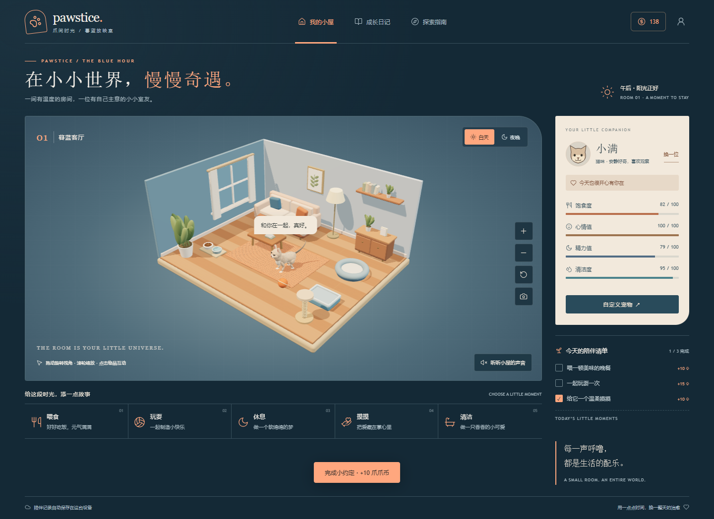

# Pawstice · 爪间时光

一间有温度的房间，一位有自己主意的小小室友。

Pawstice 是浏览器内运行的 3D 宠物探索游戏，以「暮蓝放映室」为视觉主题，支持可自定义猫狗、自主生活、家具互动、昼夜氛围与本地存档。名字组合了 paw 与 solstice，表达与宠物一起度过的温柔时光。



## 开始使用

要求 Node.js **22.12 或以上**，建议使用 `.nvmrc` 指定的 Node 22。

```sh
npm ci
npm run dev
```

访问终端显示的地址，默认是 `http://localhost:5173`。

| 命令                   | 用途                               |
| ---------------------- | ---------------------------------- |
| `npm run dev`          | 开发与热更新                       |
| `npm test`             | 配置、导航、存档与宠物组件测试     |
| `npm run lint`         | ESLint 静态检查                    |
| `npm run format`       | 格式化代码和文档                   |
| `npm run format:check` | 检查格式                           |
| `npm run build`        | 生成 `dist/` 静态产物              |
| `npm run preview`      | 预览生产构建                       |
| `npm run check`        | 依次执行规范、格式、测试、构建检查 |

## 当前玩法

- 拖动旋转房间，滚轮或双指缩放；点击食盆、球、小窝、浴盆或宠物互动。
- 宠物按需求自主散步、进食、玩耍、休息与清洁。
- 在「自定义宠物」修改物种、名字、毛色、眼睛、花纹、项圈和体型，实时预览动作。
- 导入/导出带版本校验的 JSON 外观配置；关闭放弃草稿，保存应用至房间。
- 完成每日任务、记录日记、切换昼夜、播放环境声音或保存照片。

## 项目结构

```text
src/
  main.js                    页面启动与热更新入口
  app/createGame.js          游戏编排、互动、帧循环与生命周期
  config/game.js             动作与每日任务定义
  core/
    createViewport.js        渲染器、灯光与相机
    navigation.js            可测试的 A* 寻路
    storage.js               存档读取、兼容与边界校验
  scenes/room/createRoom.js   家具、材质及交互目标
  features/pet/              宠物配置、模型、动画与独立编辑器
  ui/                       主界面、视图控制器与图标
  styles/global.css          全局主题与响应式布局
public/                     静态资源
tests/unit/                Node 内置测试运行器用例
docs/                      架构、产品、美术与验证记录
.github/workflows/ci.yml     GitHub 持续集成
```

运行产物、测试截图、浏览器临时目录、依赖目录与环境文件均不提交至仓库。

## 技术与数据

- JavaScript ES Modules、Vite、Three.js、Lucide。
- ESLint、Prettier、Node Test Runner、GitHub Actions。
- 模型、纹理和毛丝为本地程序生成，无在线模型服务依赖。
- 单机存档，无需 API 密钥或服务端。兼容旧版本，localStorage 键仍为 `little-paws-save`。
- 浏览器清理站点数据会删除进度；外观可导出 JSON，当前没有云同步。
- 开发模式提供 `window.__petGame`，生产模式不暴露调试对象。

构建后可将 `dist/` 放到静态 HTTPS 服务；使用相对资源路径，支持子目录托管。CI 只做质量检查，不自动部署。

## 开发文档

- [架构与模块边界](docs/architecture.md)
- [宠物组件与配置接口](src/features/pet/README.md)
- [产品与技术规划](docs/product-tech-plan.md)
- [视觉设计](docs/visual-design.md)
- [验证记录](docs/validation.md)
- [宠物运动与微动作](docs/pet-motion.md)
- [开发约定](CONTRIBUTING.md)

当前为可玩原型：程序化半写实造型尚非照片级毛发或完整骨骼蒙皮，移动真机性能与长期碰撞压力测试仍需完善。仓库暂未授予开源使用许可。

## 系统更新日志维护

游戏底部的「系统更新日志」展示版本记录。编辑 `src/config/releases.js`，将新版本放在最前，按「新增 / 优化 / 修复」记录实际变更；同步更新 `package.json` 与锁文件的版本，再运行 `npm run changelog` 生成 [CHANGELOG.md](CHANGELOG.md)。`npm test` 会检查版本与文档一致性。

## Vercel 部署

在线体验：[pawstice-ten.vercel.app](https://pawstice-ten.vercel.app) · [Vercel 控制台](https://vercel.com/liu-projects/pawstice)

项目关联 GitHub 仓库 `liujunxiang0076/pawstice`，Vercel 项目为 `liu-projects/pawstice`。推送 `main` 分支自动触发正式部署，其他分支用于预览部署。

`vercel.json` 固定 Vite 构建配置：安装执行 `npm ci`，构建执行 `npm run build`，发布目录为 `dist`。当前游戏无需服务端环境变量，存档保存在访问者的浏览器中；本地与线上域名的存档互相独立。

本地使用 Vercel CLI 时，先执行 `npx vercel link --project pawstice --scope liu-projects`。`.vercel/` 和 `.env.*` 仅用于本地配置，不提交到仓库。
